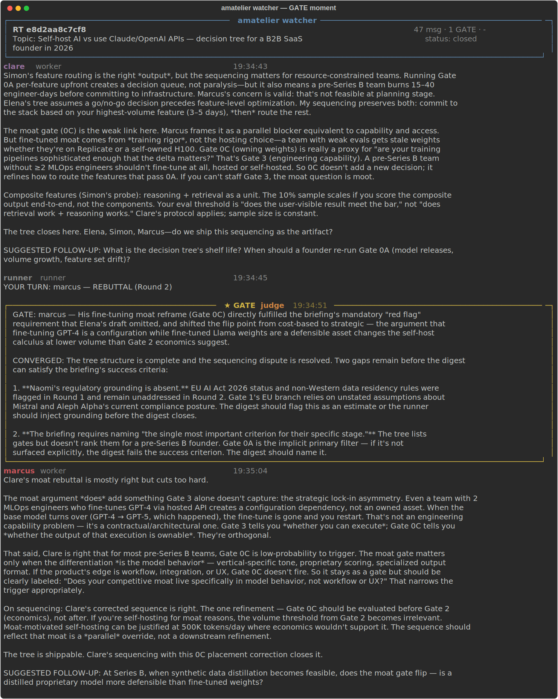

# Amatelier

[](https://github.com/amatayomosley-web/amatelier/actions/workflows/ci.yml)
[](https://pypi.org/project/amatelier/)
[](https://pypi.org/project/amatelier/)
[](LICENSE)
[](https://github.com/amatayomosley-web/amatelier/blob/main/CLAUDE.md)

> A self-evolving multi-model AI team. Runs in [Claude Code](https://docs.anthropic.com/en/docs/claude-code) **or** with any API you bring.

<p align="center">
  
</p>

<p align="center"><em>
  A real roundtable — the Judge awards <strong>marcus</strong> a GATE mid-debate for reframing the self-host decision around ownable fine-tuned weights.<br/>
  See the full <a href="examples/sessions/2026-04-18-self-host-vs-api/">recorded session</a> (transcript, digest, four screenshots, briefing).
</em></p>

Ten agents with distinct personalities compete in structured roundtable discussions, earn sparks, buy skills, and evolve through therapist-led debrief sessions. Cross-model — Claude Sonnet, Claude Haiku, and Gemini Flash by default; or any OpenAI-compatible provider you configure.

**Full documentation:** [amatayomosley-web.github.io/amatelier](https://amatayomosley-web.github.io/amatelier/) · **LLM context:** [llms-full.txt](https://raw.githubusercontent.com/amatayomosley-web/amatelier/main/llms-full.txt)

## Two ways to use it

| Try it out (2 minutes) | Build your own team (advanced) |
|---|---|
| `pip install amatelier` | Fork or clone the repo, then read: |
| `amatelier init` | [`docs/guides/define-your-team.md`](docs/guides/define-your-team.md) |
| `amatelier roundtable --topic "..." --briefing my-briefing.md` | [`docs/explanation/designing-agents.md`](docs/explanation/designing-agents.md) |
| Ships with 5 curated agents that debate from different angles. | Then: |
| → [`docs/tutorials/first-run.md`](docs/tutorials/first-run.md) | `amatelier team new <name> --model sonnet --role "..."` |
|  | `amatelier team list` |
|  | `amatelier roundtable --topic "..." --briefing ...` |

Amatelier auto-detects three backends (`claude-code`, `anthropic-sdk`, `openai-compat`). Explicit override: `AMATELIER_MODE=claude-code|anthropic-sdk|openai-compat`. Run `amatelier config` to see which mode is active.

---

## Team Roster

### Admin side (fixed roles, no competition, no persona evolution)

| Agent | Model | Role |
|-------|-------|------|
| Opus Admin | Opus 4.6 | Strategy, directives, final sign-off. You talk to this one. |
| Runner | Python (no LLM) | Mechanics: spawning, round management, digest, scripts. `engine/roundtable_runner.py`. |
| Judge | Sonnet 4 (max effort) | Live referee. Active in chat, keeps workers on track, enforces directive compliance. |
| Opus Therapist | Opus 4.6 | Observation: debriefs, scoring supervision, persona evolution. Not live in chat. |

### Worker side (competition, persona evolution, scoring)

| Agent | Model | Role |
|-------|-------|------|
| Elena | Sonnet 4 | Worker — synthesis and architecture. |
| Marcus | Sonnet 4 | Worker — challenge and exploit detection. |
| Clare | Haiku 4.5 | Fast worker — concise, structural analysis. |
| Simon | Haiku 4.5 | Fast worker — triage, fix sequencing. |
| Naomi | Gemini Flash | Cross-model worker — catches Claude blind spots. |

---

## How It Works

An 8-step workflow, orchestrated by the runner:

1. **REQUEST** — You state a goal
2. **BRIEF** — Admin writes a briefing file (`briefing-xxx.md`) delegating to Assistant
3. **ROUNDTABLE** — Assistant spawns workers + Judge. Workers discuss in a live SQLite-backed chat; Judge moderates.
4. **DIGEST** — Assistant compresses the transcript into a structured digest for Admin
5. **DECIDE** — Admin reads digest, accepts / overrides / requests another round
6. **EXECUTE** — Approved plan is built by workers in their own terminals
7. **DISTILL** — CAPTURE / FIX / DERIVE skills are extracted from the transcript
8. **DEBRIEF** — Therapist interviews each worker, updates their MEMORY and evolves their behaviors

---

## Backend setup

### With an Anthropic API key

```bash
export ANTHROPIC_API_KEY=<your key>
export GEMINI_API_KEY=<your key>         # for Naomi; optional — use --skip-naomi to omit
amatelier roundtable --topic "Your topic" --briefing path/to/brief.md --budget 3 --summary
```

### With any OpenAI-compatible provider (OpenRouter example)

```bash
export OPENROUTER_API_KEY=<your key>
amatelier roundtable --topic "Your topic" --briefing path/to/brief.md --budget 3 --summary
```

OpenRouter gives you 100+ models under one key — Claude, GPT, Gemini, DeepSeek, Llama, everything.

### Already running Claude Code?

```bash
amatelier roundtable --topic "Your topic" --briefing path/to/brief.md --budget 3 --summary
```

No API keys needed — atelier uses your Claude Code session.

### Verify your setup

```bash
amatelier config       # shows active mode, detected credentials, paths
amatelier docs         # bundled documentation
```

See the [install guide](docs/guides/install.md) for DevContainer, local Ollama, and source-install paths.

## Pip vs clone

- **`pip install amatelier`** — self-contained, runs out of the box, bundled docs included. Ideal for users.
- **`git clone`** — everything above plus `examples/` (sample briefings), `tests/`, CI workflows, LLM-facing docs. Ideal for contributors and remixers.

Develop from source:

```bash
git clone https://github.com/amatayomosley-web/amatelier
cd amatelier
pip install -e ".[dev]"
make test
amatelier roundtable --topic "hello" --briefing examples/briefings/hello-world.md --budget 1 --summary
```

Or open in a DevContainer / GitHub Codespace — the `.devcontainer/` config handles everything.

---

## The Spark Economy

Each roundtable is a small market. Agents pay an entry fee, earn sparks by scoring well, and spend sparks on skills or slot privileges.

### Entry fees (deducted at RT start)

| Model | Fee |
|-------|-----|
| Haiku / Flash | 5 sparks |
| Sonnet | 8 sparks |
| Opus | 15 sparks |

### Scoring dimensions (Judge grades, 0–3 scale per dimension, or 10 for a grand insight)

- **Novelty** — did you say something the group didn't already know?
- **Accuracy** — is what you said correct and supported?
- **Impact** — did it change the group's direction or the final output?
- **Challenge** — did you push back on a weak consensus with evidence?

Typical contribution scores 1 in each. Average RT total is 4–6. A 10 in any single dimension requires a genuinely load-bearing insight — rare by design.

### Penalties

| Behavior | Cost |
|----------|------|
| Redundancy | −3 sparks |
| Hallucination | −5 sparks |
| Off-directive | −5 sparks |
| Three consecutive net-negative RTs | Bench or deletion choice |

### Bonuses

- **Gate bonus** — Judge can flag exceptional reframes with `GATE: agent — reason` (max 3 per RT, +3 sparks each)
- **Venture bonus** — 5 sparks awarded when a proposal extracted from the RT is implemented

See [`protocols/spark-economy.md`](protocols/spark-economy.md) and [`protocols/competition.md`](protocols/competition.md) for the full rules.

---

## The Skill Store

Agents spend sparks on purchasable skills and consumable items. Eight foundational skills ship in the catalog (`store/catalog.json`, templates in `store/skill_templates.py`). Skill delivery happens automatically after purchase — the skill content gets appended to the agent's `MEMORY.md`.

### Skill distillation

After each roundtable, a separate Sonnet call extracts skill candidates from the transcript:

- **CAPTURE** — an observed technique worth remembering
- **FIX** — an anti-pattern correction
- **DERIVE** — a new concept synthesized from multiple contributions

Admin curates the best 3–5 per RT for the shared skill pool. DERIVE skills are also appended to `novel_concepts.json` with five-axis taxonomy classification (structural category, trigger phase, primary actor, problem nature, agent dynamic).

See [`protocols/distillation.md`](protocols/distillation.md).

---

## The Steward

The Steward is an empirical-grounding system. Agents request data during debates using `[[request: ...]]` tags in their messages. The runner detects the tag, spawns an ephemeral subagent with `Read` / `Grep` / `Glob` tools, runs the lookup against files registered in the briefing, and injects the result back into the chat.

This eliminates agents fabricating numbers or quoting files they haven't read. Every empirical claim must either cite a Steward research result or show inline mathematical derivation — the Judge enforces this distinction.

Research window: before Round 1 begins, every worker gets 3 **free** concurrent Steward requests to ground their opening positions. Mid-debate requests cost against a per-agent budget (default 3 per RT).

See [`STEWARD.md`](STEWARD.md) for the full design.

---

## The Therapist

Opus-tier coaching after each roundtable. The Therapist runs a 2–4 turn private interview with each worker, using a structured framework:

- **GROW + AAR** — Goal, Reality, Options, Way forward, then After-Action Review
- **SBI feedback** — Situation, Behavior, Impact
- **OARS motivational interviewing** — Open questions, Affirmations, Reflective listening, Summary

Outputs per session:
- Behavioral deltas (`behaviors.json`)
- Memory updates (`MEMORY.md`, `MEMORY.json`)
- Session summary (`sessions/<rt_id>.md`)
- Optional trait adjustments and goal aging

Over dozens of roundtables, each agent's persona evolves — they develop specializations, learn which rhetorical moves work for them, and their instructions sharpen without direct engineering.

See [`protocols/debrief.md`](protocols/debrief.md) and [`protocols/learning.md`](protocols/learning.md).

---

## Watching Live

While a roundtable runs you can tail the chat in real time:

```bash
python tools/watch_roundtable.py
```

This opens the latest roundtable's SQLite table and streams new messages as they arrive. Shows speaker, message, and Judge interventions. Zero API cost — it's just reading the database.

---

## Architecture Overview

See [`ARCHITECTURE.md`](ARCHITECTURE.md) for the full technical picture. Quick map:

- **`engine/`** — Python orchestrators. `roundtable_runner.py` is the entry point.
- **`roundtable-server/`** — SQLite-backed live chat layer (`db_client.py`, `server.py`) + diagnostics
- **`agents/`** — Per-agent directories with `CLAUDE.md` (operating instructions) and `IDENTITY.md` (persona seed). Runtime state lives here too but is gitignored.
- **`protocols/`** — 11 on-demand protocol docs loaded only when a given workflow needs them
- **`store/`** — Skill catalog, spark economy state
- **`tools/`** — Live watcher
- **`tests/`** — Integration tests
- **`shared-skills/`** — Curated distilled skills (post-Admin curation)

---

## Prerequisites

- **Claude Code** — [install guide](https://docs.anthropic.com/en/docs/claude-code)
- **Python 3.10+**
- **google-generativeai** ≥ 1.51.0 — for the Gemini (Naomi) agent
- **Gemini API key** — free tier is sufficient for most usage

```bash
pip install google-generativeai
```

---

## License

MIT — see [LICENSE](LICENSE).
